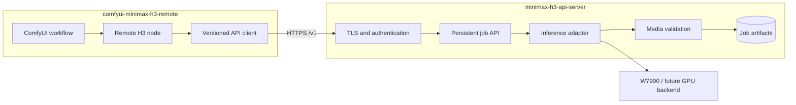

# comfyui-minimax-h3-remote 项目目的与服务端/客户端演进规划

> 文档状态：架构规划稿
> 日期：2026-09-07
> 当前代码位置：`h3_api_server/custom_nodes/comfyui-minimax-h3-remote`
> 目标形态：一个独立服务端产品 + 一个独立 ComfyUI 客户端产品

## 1. 项目目的

`comfyui-minimax-h3-remote` 的目标，是让用户在本地 ComfyUI 工作流中使用远程 MiniMax H3 推理能力，而不需要在本地安装模型、ROCm/CUDA 推理环境或高性能 GPU。

整个系统需要解决以下问题：

1. **算力与工作流分离**：MiniMax H3、模型权重和 GPU 运行时部署在云端；本地 ComfyUI 只负责工作流编排、媒体上传和结果展示。
2. **长任务可靠执行**：视频生成采用“提交任务 -> 排队 -> 轮询 -> 下载结果”的异步模型，避免分钟级或小时级 HTTP 长连接超时。
3. **统一多模态入口**：通过一套节点支持 T2V、I2V、FL2V 和 R2V，并输出 ComfyUI 原生 `VIDEO`、`IMAGE` 和 `AUDIO`。
4. **隐藏后端复杂度**：客户端不感知 `sd-cli`、模型路径、GPU 编号、VAE 放置和 ROCm 规避逻辑。
5. **建立可演进边界**：未来可以替换推理引擎、GPU 类型、存储和调度系统，而不要求用户修改已有 ComfyUI 工作流。

本项目不是 MiniMax H3 模型本身，也不分发模型权重。客户端代码、服务端代码和模型许可证属于三个独立的授权边界。

## 2. 产品拆分决策

建议将当前实现定义为同一产品族下的两个独立项目：

| 项目 | 建议仓库名 | 部署位置 | 核心职责 |
|---|---|---|---|
| 客户端 | `comfyui-minimax-h3-remote` | 用户本地 ComfyUI | 参数收集、媒体编码、API 调用、轮询、下载、转换为 ComfyUI 类型 |
| 服务端 | `minimax-h3-api-server` | 云端 GPU 主机 | 鉴权、校验、上传预处理、队列、推理、取消、媒体验收、结果持久化和运维 |

当前可以继续在一个工作区开发，但必须按照两个独立发布物维护。成熟后再拆成两个 GitHub 仓库，不让客户端发布节奏被服务端镜像、模型和 GPU 环境绑定。



## 3. 当前实现基线

### 3.1 当前客户端

当前目录已经包含：

```text
comfyui-minimax-h3-remote/
├── __init__.py
├── node.py
├── h3_client.py
└── README.md
```

当前节点能够：

- 提交 T2V、I2V、FL2V、R2V 请求；
- 以 multipart 上传图片、视频和音频；
- 轮询远程任务状态；
- 在 ComfyUI 中断时请求取消任务；
- 下载 WebM；
- 输出 `VIDEO`、`IMAGE`、`AUDIO`、FPS 和 `job_id`。

### 3.2 当前服务端

当前服务端位于工作区的 `h3_api_server/src/h3_api_server`，已经具备：

- Bearer API Key 鉴权；
- 单 worker 串行队列；
- 持久化 `job.json`；
- T2V、I2V、FL2V、R2V；
- 条件模式自动 `vae=cpu`；
- 上传媒体标准化；
- 任务取消和重启恢复；
- WebM 全量解码、帧唯一、黑屏和静音检查；
- Docker、模型 SHA-256 门禁和健康检查。

当前四种最小模式已经在 W7900 上经真实 API 运行验证。这个基线在拆仓过程中必须保持不变。

## 4. 客户端项目定义

### 4.1 定位

`comfyui-minimax-h3-remote` 是面向 ComfyUI 用户的轻量客户端。它应当可以公开发布，并尽量只使用 ComfyUI 已自带的 Python 依赖。

客户端只依赖稳定 API 契约，不应包含：

- 模型权重或模型下载逻辑；
- `sd-cli` 命令和模型文件路径；
- ROCm/CUDA 设备选择；
- 服务端队列和任务持久化实现；
- 云端容器、反向代理和对象存储凭据。

### 4.2 客户端职责

- 提供 `MiniMax H3 (remote)` 节点；
- 收集 T2V、I2V、FL2V、R2V 参数；
- 将 ComfyUI `IMAGE`、`VIDEO`、`AUDIO` 转换为上传媒体；
- 通过 Bearer API Key 调用服务端；
- 显示排队位置、采样进度和 ETA；
- 在 ComfyUI 中断执行时请求取消远程任务；
- 下载结果并转换为原生 ComfyUI 类型；
- 返回 `job_id`，支持故障排查和结果重取。

### 4.3 建议客户端仓库结构

```text
comfyui-minimax-h3-remote/
├── __init__.py
├── node.py
├── h3_client.py
├── README.md
├── LICENSE
├── pyproject.toml
├── examples/
│   ├── t2v_workflow.json
│   ├── i2v_workflow.json
│   ├── fl2v_workflow.json
│   └── r2v_workflow.json
├── tests/
│   ├── test_client.py
│   ├── test_media_encoding.py
│   └── test_node_contract.py
└── doc/
    ├── 项目目的与服务端客户端演进规划.md
    ├── installation.md
    └── troubleshooting.md
```

### 4.4 客户端发布建议

- GitHub 仓库：公开；
- 已采用 Apache License 2.0，与远端仓库现有 `LICENSE` 保持一致；
- 首个版本：`v0.1.0`；
- 首期通过 GitHub Release 发布，后续申请 ComfyUI Registry；
- Release 不包含模型、服务端镜像和 API Key；
- API Key 默认从 `H3_API_KEY` 环境变量读取，节点输入仅作为显式覆盖；
- 发布前至少在一个干净 ComfyUI 环境执行安装测试和 T2V/I2V 工作流。

## 5. 服务端项目定义

### 5.1 定位

`minimax-h3-api-server` 是独立 GPU 推理服务。它既可以服务 ComfyUI，也应允许未来的 CLI、Web UI、自动化流水线或其他客户端复用。

服务端不依赖 ComfyUI，也不返回 ComfyUI 私有对象。服务端只提供标准 HTTP、JSON、multipart 和媒体文件。

### 5.2 服务端职责

- Bearer API Key 鉴权；
- 参数白名单和资源上限校验；
- 图片、视频、音频上传与标准化；
- 并发为 1 的持久化任务队列；
- `sd-cli` argv 安全构造，禁止 `shell=True`；
- T2V 使用 GPU VAE，条件模式自动使用 CPU VAE；
- 任务取消、超时和重启恢复；
- WebM 全量解码、帧唯一性、黑屏和静音校验；
- 任务 manifest、指标、日志和结果文件持久化；
- 健康检查、模型完整性和 GPU 可见性检查；
- TLS 反代、私网接入和生产运维文档。

### 5.3 建议服务端仓库结构

```text
minimax-h3-api-server/
├── src/minimax_h3_server/
│   ├── api.py
│   ├── schemas.py
│   ├── jobs.py
│   ├── store.py
│   ├── runner.py
│   ├── media.py
│   ├── preprocess.py
│   ├── health.py
│   └── engines/
│       ├── base.py
│       └── stable_diffusion_cpp.py
├── tests/
├── deploy/
│   ├── Dockerfile
│   ├── docker-compose.yml
│   ├── Caddyfile.example
│   └── kubernetes/
├── docs/
│   ├── api.md
│   ├── deployment.md
│   ├── security.md
│   └── operations.md
├── openapi/
│   └── v1.json
├── pyproject.toml
├── README.md
└── LICENSE
```

### 5.4 服务端发布建议

- 首期保持私有仓库，先完成生产安全和运维闭环；
- 若后续开源，建议使用 Apache-2.0；
- 容器版本与代码版本一致，例如 `server-v0.1.0`；
- 模型权重不进入代码仓库或通用发行镜像；
- 镜像 tag、digest、`sd-cli` SHA 和模型 SHA 写入 release manifest；
- 服务端许可证不得暗示授予 MiniMax H3 模型的使用权。

## 6. 服务端与客户端之间的契约

两个项目唯一稳定耦合点是版本化 API。客户端不得依据服务端内部目录、容器名称或推理命令做判断。

### 6.1 当前 v1 契约

| 方法 | 路径 | 用途 |
|---|---|---|
| `GET` | `/healthz` | 鉴权、模型、GPU 和队列健康状态 |
| `POST` | `/v1/generate` | JSON T2V 或 multipart 条件任务提交 |
| `GET` | `/v1/jobs/{job_id}` | 查询状态、进度、后端和结果指标 |
| `GET` | `/v1/jobs/{job_id}/result` | 下载 WebM |
| `POST` | `/v1/jobs/{job_id}/cancel` | 取消排队或运行中的任务 |

状态机保持：

```text
queued -> running -> done
                  -> error
queued/running    -> canceled
```

### 6.2 版本兼容原则

- `/v1` 内只做向后兼容的字段新增；
- 删除字段、改变类型或改变状态语义时发布 `/v2`；
- 客户端忽略不认识的响应字段；
- 服务端拒绝不认识的请求字段，尽早暴露拼写和版本错误；
- 客户端 release 声明支持的服务端 API 范围；
- 服务端未来增加 `GET /v1/capabilities`；
- 后续响应头增加 `X-H3-API-Version` 和 `X-H3-Server-Version`。

### 6.3 建议兼容矩阵

| 客户端版本 | API 版本 | 服务端版本 | 状态 |
|---|---|---|---|
| `0.1.x` | `v1` | `0.1.x` | 首个稳定组合 |
| `0.2.x` | `v1` | `0.1.x - 0.2.x` | 能力发现和错误模型增强 |
| `1.x` | `v1` | `1.x` | 稳定公开发布目标 |

## 7. 当前代码到双项目的迁移方案

### Phase 0：锁定当前基线

- 保留当前四模式实测产物和 job manifest；
- 固定当前 `/v1` 请求/响应样例；
- 将现有自动测试作为迁移前基线；
- 不在迁移过程中修改推理行为。

### Phase 1：独立发布客户端

- 将 `custom_nodes/comfyui-minimax-h3-remote` 提取为独立仓库；
- 保留 Apache-2.0 `LICENSE`，补充安装文档和四种示例工作流；
- 添加不依赖真实服务端的协议测试；
- 在真实本地 ComfyUI 中完成节点安装、T2V 和 I2V 浏览器验收；
- 发布 `v0.1.0` GitHub Release。

### Phase 2：规范化服务端仓库

- 将 `h3_api_server/src/h3_api_server` 提取为服务端仓库；
- 将包名逐步规范为 `minimax_h3_server`，保留一版兼容入口；
- 导出并版本控制 OpenAPI `v1` 文档；
- 建立构建、单测、容器 smoke 和安全扫描 CI；
- 发布内部 `server-v0.1.0` 镜像。

### Phase 3：建立跨仓库契约测试

- 服务端 CI 导出 OpenAPI artifact；
- 客户端 CI 使用 mock server 验证请求和响应；
- 每次服务端 release 使用最新稳定客户端跑兼容测试；
- 每次客户端 release 验证当前和上一个服务端次版本；
- 维护公开兼容矩阵和弃用周期。

## 8. 未来演进方向

### 8.1 客户端演进

1. **节点拆分**：从单一综合节点演进为 T2V、I2V/FL2V、R2V、Job Resume 和 Cancel 节点。
2. **任务恢复**：新增按 `job_id` 查询/下载节点，ComfyUI 重启后不重复生成。
3. **服务能力发现**：根据 `/v1/capabilities` 动态限制分辨率、帧数和模式。
4. **更好的进度体验**：显示排队位置、阶段、ETA 和服务端错误摘要。
5. **批量引用输入**：用 ComfyUI 动态/autogrow 输入支持多图、多视频和多音频。
6. **Registry 发布**：补齐节点元数据、版本检查、图标、示例工作流和自动安装。
7. **多服务配置**：支持开发、私网、生产等命名端点，密钥仍由环境或本地凭据存储提供。

### 8.2 服务端演进

1. **推理引擎抽象**：把 `stable-diffusion.cpp` 放入 `InferenceEngine` 适配层，未来可接原生 ComfyUI、PyTorch 或其他后端。
2. **能力端点**：公开引擎、模式、模型 revision、尺寸和资源限制，不暴露敏感主机信息。
3. **对象存储**：大文件结果写入 S3/OSS，通过短期预签名 URL 下载。
4. **事件进度**：在保留轮询的同时增加 SSE；WebSocket 不是首要依赖。
5. **任务保留策略**：按 TTL 自动清理上传、日志和结果，支持保留策略配置。
6. **可观测性**：增加结构化日志、Prometheus 指标、请求 ID、队列时长和生成阶段耗时。
7. **安全增强**：密钥轮换、每 Key 配额、IP 白名单、审计日志和可选 OIDC。
8. **调度扩展**：从单卡串行队列演进为每 GPU 一个 worker；只有明确多用户需求时才引入 Redis/PostgreSQL。
9. **运维能力**：增加 readiness/liveness 分离、优雅停机、磁盘水位和 GPU 忙闲门禁。

### 8.3 协议演进

- 支持幂等键，避免网络重试重复生成；
- 支持结果范围下载和断点续传；
- 支持受控部署下的 webhook；
- 统一机器可读错误码，例如 `INVALID_MEDIA`、`QUEUE_FULL`、`MODEL_UNAVAILABLE`；
- 将 job manifest 中可公开的部分作为 API 资源返回；
- 新协议优先通过字段扩展实现，不轻易创建 `/v2`。

## 9. 安全与许可证边界

### 9.1 安全原则

- 服务端生产环境只通过 HTTPS 或私有网络访问；
- 客户端仓库和工作流示例不得包含真实 API Key；
- API Key 不写入日志、截图、示例 JSON 或 GitHub Issue；
- 上传媒体按类型、大小和数量限制，并由解码器验证真实内容；
- 服务端不执行用户文件名、prompt 或自定义 shell 参数；
- 公开健康检查时裁剪 GPU 型号、文件路径等敏感信息。

### 9.2 许可证原则

- 客户端代码许可证与服务端代码许可证分别声明；
- 代码许可证不覆盖 MiniMax H3 模型权重；
- README 明确模型商业授权和地域限制；
- 服务端镜像若包含第三方二进制，需要保留对应 NOTICE 和许可证；
- 正式公开仓库前完成依赖和媒体编解码许可证审查。

## 10. 里程碑与验收标准

| 里程碑 | 目标 | 通过标准 |
|---|---|---|
| C0 | 客户端仓库初始化 | LICENSE、README、测试、四模式示例齐全 |
| C1 | 本地 ComfyUI 验收 | 节点可见；T2V/I2V 输出 VIDEO+IMAGE+AUDIO |
| C2 | 客户端首发 | GitHub `v0.1.0` 可下载，干净环境安装通过 |
| S0 | 服务端仓库初始化 | API、Docker、部署、测试边界独立完整 |
| S1 | OpenAPI 契约固定 | `v1` schema 入库，客户端 contract test 通过 |
| S2 | 生产安全门禁 | HTTPS、随机 Key、限流、上传限制和 TTL 清理通过 |
| S3 | 长任务验收 | 15 秒任务、断网重取、取消和重启恢复通过 |
| X1 | 双仓库联合发布 | 兼容矩阵、联合 smoke、版本和 changelog 完整 |

### 当前进度（2026-09-08）

- **C0 已完成**：独立公开仓库、Apache-2.0、README、`pyproject.toml`、15 项无依赖测试、CI 和四种 ComfyUI v1.0 示例工作流均已落地。
- **C1 已完成**：固定 ComfyUI v0.34.0 的干净环境成功加载节点；浏览器显示四个模板；T2V 与经原生 `LoadImage` 输入的 I2V 均通过 ComfyUI `/prompt` 完成远程生成、下载和 VIDEO+IMAGE+AUDIO 解码。证据见 `doc/C1_ComfyUI验收记录_20260908.md`。
- **C2 部分完成**：GitHub `v0.1.0` Release 已发布，安装 ZIP 已从 GitHub 回下载、通过 SHA-256 并在干净 ComfyUI v0.34.0 中成功加载节点和四模板；ComfyUI Registry 因尚未配置 `REGISTRY_ACCESS_TOKEN` 保持待办。证据见 `doc/C2_发布记录_v0.1.0.md`。
- **S0/S1 已完成**：服务端已提取到独立私有仓库 `https://github.com/zihaomu/minimax-h3-api-server`（初始 commit `ac102fe`）；31 项服务端测试通过，独立镜像在 GPU1/`127.0.0.1:18001` 完成五模型校验与 live smoke；`/v1/capabilities`、鉴权 `/openapi.json`、版本响应头及 `openapi/v1.json` 快照已固定。服务端验收证据位于该仓库 `docs/S0_S1验收记录_20260908.md`。
- **S2 应用侧已完成**：服务端已实现认证后滑窗限流、`X-Request-ID`、脱敏 JSON 审计日志、请求/保留指标，以及仅清理终态任务的启动时和周期 TTL 清理；四项配置已同步到 Dockerfile、Compose、`run.sh` 和环境模板，OpenAPI v1 以兼容字段扩展，44 项服务端测试通过。证据见服务端仓库 `docs/S2_生产安全验收记录_20260908.md`。真实域名证书和客户 IP/CIDR 白名单仍等待部署参数，因此 S2 的外部网络门禁尚未签收。
- **S3 已完成**：真实运行中取消、独立进程断连重取、容器异常终止后的持久化恢复、子进程 PID 立即落盘、960x544x362 完整生成和 live TTL 清理均通过。正式长任务 `20260908T061814Z_22aa792034ac` 在 7,303.507 秒内完成，362/362 帧唯一、15.041666 秒、24 FPS、32 kHz 双声道，下载 SHA 与服务端一致；隔离 TTL 任务 `20260908T082230Z_fc8babba2b7e` 下载后自动变为 404 且目录删除。证据见服务端仓库 `docs/S3_长任务验收记录_20260908.md`。

## 11. 推荐的近期执行顺序

1. 创建公开客户端仓库 `comfyui-minimax-h3-remote`，不提交服务端和模型文件。
2. 沿用客户端现有 Apache-2.0 License，并补四个最小工作流 JSON。
3. 在真实用户机器的 ComfyUI 中完成节点安装和 T2V/I2V 测试。
4. 创建独立服务端仓库 `minimax-h3-api-server`，先保持私有。
5. 导出当前 FastAPI OpenAPI schema，并建立客户端 mock contract test。
6. 配置真实 HTTPS/私网端点、密钥轮换和结果 TTL。
7. 客户端发布 `v0.1.0`，服务端发布 `server-v0.1.0`，同时公布兼容矩阵。

## 12. 最终原则

客户端负责提供稳定、自然的 ComfyUI 使用体验；服务端负责安全、可靠地消耗 GPU 并交付经过验证的媒体结果。两者可以独立部署、独立升级、独立授权，但必须共同遵守版本化 API 契约。

只要这个边界保持稳定，未来无论后端从单张 W7900 扩展到多 GPU，还是从 `stable-diffusion.cpp` 切换到其他推理引擎，用户现有的 ComfyUI 工作流都不需要被推倒重建。
